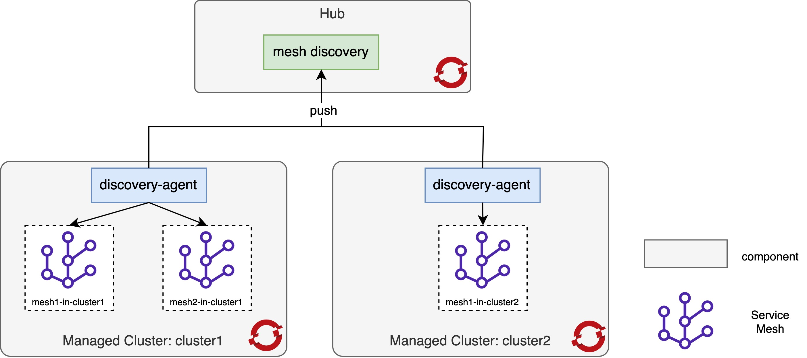
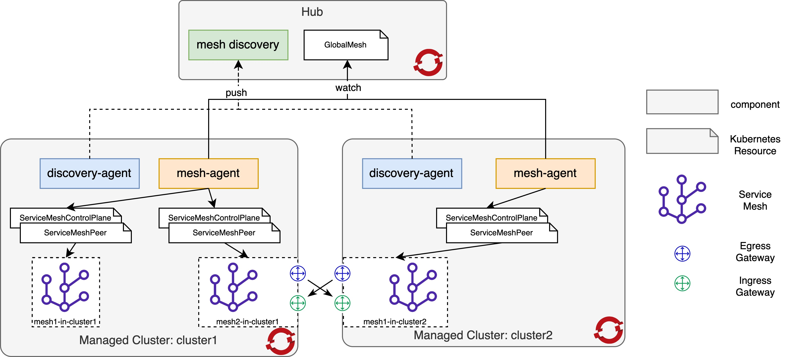
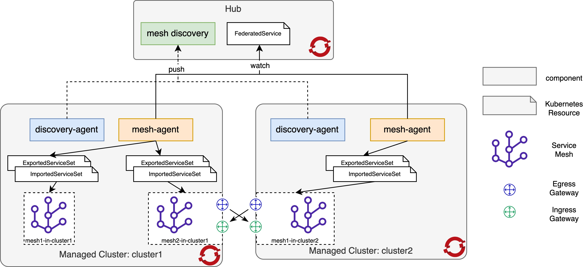

# Multicluster Mesh Addon

multicluster-mesh-addon is an enhanced addon created with [addon-framework](http://github.com/open-cluster-management-io/addon-framework), it is used to manage(discovery, deploy and federate) service meshes across multiple clusters and applied in Red Hat Advanced Cluster Management for Kubernetes.

## Core Concepts

1. **Mesh** - a `mesh` resource is mapping to a physical service mesh in a managed cluster, it contains the desired state and status of the backend service mesh.



For each physical service mesh in a managed cluster, a mesh resource is created in the managed cluster namespace of hub cluster. An example of mesh resource would resemble the following yaml snippet:

```yaml
apiVersion: mesh.open-cluster-management.io/v1alpha1
kind: Mesh
metadata:
  name: managedcluster1-istio-system-basic
spec:
  clusters: managedcluster1
  controlPlane:
    components: ["istio-discovery", "istio-ingress", "mesh-config", "telemetry-common", "tracing"]
    namespace: istio-system
    profiles: ["default"]
    version: v2.1
  meshMemberRoll: ["istio-apps"]
  meshProvider: Openshift Service Mesh
  trustDomain: cluster.local
status:
  readiness:
    components:
      pending: []
      ready: ["istio-discovery", "istio-ingress", "mesh-config", "telemetry-common", "tracing"]
      unready: []
```

2. **MeshDeployment** - `meshdeployment` resource is used to deploy physical service meshes to managed cluster(s), it supports deploying multiple physical service meshes to different managed clusters with one mesh template.



An example of meshdeployment resource would resemble the following yaml snippet:

```yaml
apiVersion: mesh.open-cluster-management.io/v1alpha1
kind: MeshDeployment
metadata:
  name: mesh
spec:
  clusters: ["managedcluster1", "managedcluster2"]
  controlPlane:
    components: ["prometheus", "istio-discovery", "istio-ingress", "mesh-config", "telemetry-common", "tracing"]
    namespace: mesh-system
    profiles: ["default"]
    version: v2.1
  meshMemberRoll: ["mesh-apps"]
  meshProvider: Openshift Service Mesh
status:
  appliedMeshes: ["managedcluster1-mesh", "managedcluster2-mesh"]
```

3. **MeshFederation** - `meshfederation` resource is used to federate service meshes so that the physical service meshes located in one cluster or different clusters to securely share and manage traffic between meshes while maintaining strong administrative boundaries in a multi-tenant environment.



An example of meshfederation resource would resemble the following yaml snippet:

```yaml
apiVersion: mesh.open-cluster-management.io/v1alpha1
kind: MeshFederation
metadata:
  name: mcsm
spec:
  meshPeers:
  - peers:
    - name: managedcluster1-mesh
      cluster: managedcluster1
    - name: managedcluster2-mesh
      cluster: managedcluster2
  trustConfig:
    trustType: Limited
status:
  federatedMeshes:
  - peer:
    - managedcluster1-mesh
    - managedcluster1-mesh
```

## Getting Started

### Prerequisites

- Ensure [docker](https://docs.docker.com/get-started) 17.03+ is installed.
- Ensure [golang](https://golang.org/doc/install) 1.15+ is installed.
- Prepare an environment of [Red Hat Advanced Cluster Management for Kubernetes](https://access.redhat.com/documentation/en-us/red_hat_advanced_cluster_management_for_kubernetes/) and login to the hub cluster with `oc` command line tool.

### Build and Deploy

1. Build and push docker image:

```bash
make docker-build docker-push IMAGE=quay.io/<your_quayio_username>/multicluster-mesh-addon:latest
```

2. Deploy the multicluster-mesh-addon to hub cluster:

```
make deploy IMAGE=quay.io/<your_quayio_username>/multicluster-mesh-addon:latest
```

## How to use

1. If you have installed [Openshift Service Mesh](https://docs.openshift.com/container-platform/4.6/service_mesh/v2x/ossm-about.html) in any managed cluster, then you should find a mesh resource created in its namespace of hub cluster:

```bash
# oc -n managedcluster1 get mesh
NAME                                CLUSTER          VERSION   PEERS    AGE
managedcluster1-istio-system-basic  managedcluster1  v2.1               80m
```

2. You can also deploy new service meshes to managed clusters, for example, creating the following `meshdeployment` resource to deploy new service meshes to managed cluster `managedcluster1` and `managedcluster2`:

```bash
cat << EOF | oc apply -f -
apiVersion: mesh.open-cluster-management.io/v1alpha1
kind: MeshDeployment
metadata:
  name: mesh
  namespace: open-cluster-management
spec:
  clusters: ["managedcluster1", "managedcluster2"]
  controlPlane:
    components: ["prometheus", "istio-discovery", "istio-ingress", "mesh-config", "telemetry-common", "tracing"]
    namespace: mesh-system
    profiles: ["default"]
    version: v2.1
  meshMemberRoll: ["mesh-bookinfo"]
  meshProvider: Openshift Service Mesh
EOF
```

3. Then verify the created service meshes:

```bash
# oc get mesh -A
NAMESPACE        NAME                  CLUSTER          VERSION  PEERS  AGE
managedcluster1  managedcluster1-mesh  managedcluster1  v2.1            19m
managedcluster2  managedcluster2-mesh  managedcluster2  v2.1            19m
```

4. You can also federate `managedcluster1-mesh` and `managedcluster2-mesh` by creating a `meshfederation` resource in hub cluster with the following command:

```bash
cat << EOF | oc apply -f -
apiVersion: mesh.open-cluster-management.io/v1alpha1
kind: MeshFederation
metadata:
  name: mcsm
  namespace: open-cluster-management
spec:
  meshPeers:
  - peers:
    - name: managedcluster1-mesh
      cluster: managedcluster1
    - name: managedcluster2-mesh
      cluster: managedcluster2
  trustConfig:
    trustType: Limited
EOF
```

5. To verify the meshes are federated, you can deploy part(productpage,details,reviews-v1) of the [bookinfo application](https://istio.io/latest/docs/examples/bookinfo/) in managed cluster `managedcluster1`:

_Note:_ currently the verify steps have to be executed in the managed cluster, we're working on the service discovery and service federation now.

```bash
oc create ns mesh-bookinfo
oc apply -n mesh-bookinfo -f https://raw.githubusercontent.com/maistra/istio/maistra-2.1/samples/bookinfo/platform/kube/bookinfo.yaml -l 'app in (productpage,details)'
oc apply -n mesh-bookinfo -f https://raw.githubusercontent.com/maistra/istio/maistra-2.1/samples/bookinfo/platform/kube/bookinfo.yaml -l app=reviews,version=v1
oc apply -n mesh-bookinfo -f https://raw.githubusercontent.com/maistra/istio/maistra-2.1/samples/bookinfo/platform/kube/bookinfo.yaml -l service=reviews
oc apply -n mesh-bookinfo -f https://raw.githubusercontent.com/maistra/istio/maistra-2.1/samples/bookinfo/platform/kube/bookinfo.yaml -l 'account'
oc apply -n mesh-bookinfo -f https://raw.githubusercontent.com/maistra/istio/maistra-2.1/samples/bookinfo/networking/bookinfo-gateway.yaml
```

6. Then deploy the remaining part(reviews-v2, reviews-v3, ratings) of [bookinfo application](https://istio.io/latest/docs/examples/bookinfo/) in managed cluster `managedcluster2`:

```bash
oc create ns mesh-bookinfo
oc apply -n mesh-bookinfo -f https://raw.githubusercontent.com/maistra/istio/maistra-2.1/samples/bookinfo/platform/kube/bookinfo.yaml -l app=reviews,version=v2
oc apply -n mesh-bookinfo -f https://raw.githubusercontent.com/maistra/istio/maistra-2.1/samples/bookinfo/platform/kube/bookinfo.yaml -l app=reviews,version=v3
oc apply -n mesh-bookinfo -f https://raw.githubusercontent.com/maistra/istio/maistra-2.1/samples/bookinfo/platform/kube/bookinfo.yaml -l service=reviews
oc apply -n mesh-bookinfo -f https://raw.githubusercontent.com/maistra/istio/maistra-2.1/samples/bookinfo/platform/kube/bookinfo.yaml -l app=ratings
oc apply -n mesh-bookinfo -f https://raw.githubusercontent.com/maistra/istio/maistra-2.1/samples/bookinfo/platform/kube/bookinfo.yaml -l 'account'
```

7. Create `exportedserviceset` resource in managed cluster `managedcluster2` to export services(reviews and ratings) from `managedcluster2-mesh`:

```bash
cat << EOF | oc apply -f -
apiVersion: federation.maistra.io/v1
kind: ExportedServiceSet
metadata:
  name: managedcluster1-mesh
  namespace: mesh-system
spec:
  exportRules:
  - type: NameSelector
    nameSelector:
      namespace: mesh-bookinfo
      name: reviews
  - type: NameSelector
    nameSelector:
      namespace: mesh-bookinfo
      name: ratings
EOF
```

9. Create `importedserviceset` resource in managed cluster `managedcluster1` to import services(reviews and ratings) from `managedcluster1-mesh`:

```bash
cat << EOF | oc apply -f -
apiVersion: federation.maistra.io/v1
kind: ImportedServiceSet
metadata:
  name: managedcluster2-mesh
  namespace: mesh-system
spec:
  importRules:
    - type: NameSelector
      importAsLocal: true
      nameSelector:
        namespace: mesh-bookinfo
        name: reviews
        alias:
          namespace: mesh-bookinfo
    - type: NameSelector
      importAsLocal: true
      nameSelector:
        namespace: mesh-bookinfo
        name: ratings
        alias:
          namespace: mesh-bookinfo
EOF
```

9. Access the bookinfo from your browser with the following address from `managedcluster1` cluster:

```bash
echo http://$(oc -n mesh-system get route istio-ingressgateway -o jsonpath={.spec.host})/productpage
```

_Note_: The expected result is that by refreshing the page several times, you should see different versions of reviews shown in productpage, presented in a round robin style (red stars, black stars, no stars). Because reviews-v2, reviews-v3 and ratings service are running in another mesh, if you could see black stars and red stars reviews, then it means traffic across meshes are successfully routed.

## Future Work

* Services and workloads discovery
* Federate services across meshes
* Deploy application across meshes
