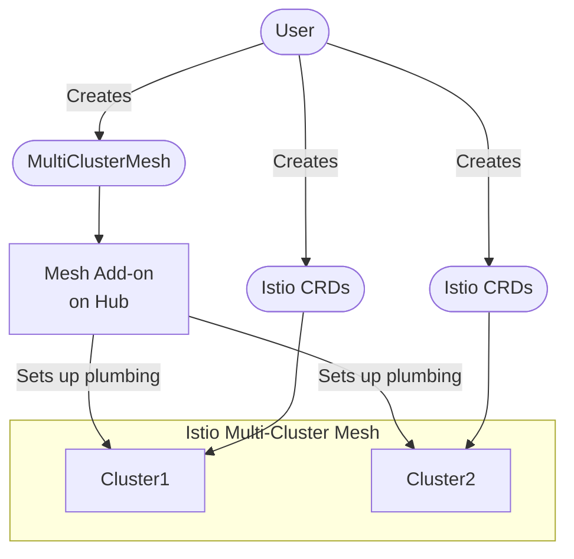

# Architecture

The addon runs on an [OCM] hub cluster and automates [multi-cluster Istio service mesh setup][multi-cluster] across managed clusters.

The CRD defaults target OSSM on OpenShift.
For vanilla Kubernetes clusters, override `spec.operator` fields to use Sail instead.

## What the Addon Does

The addon manages the "plumbing" (trust and connectivity) while you configure the mesh control plane using the Istio CRDs.

- **Operator Lifecycle**: Installs the service mesh operator on managed clusters via OLM
- **Trust Distribution**: Mints per-cluster intermediate CAs from a shared root using [cert-manager], implementing Istio's [Plug-in CA] pattern for mTLS trust
- **Endpoint Discovery** *(in progress)*: Creates [ManagedServiceAccount] resources for each cluster.
  Remote secret distribution is not yet implemented.

For a detailed resource-level diagram, see the [design doc](dev/design.md#architecture).

## Supported Topologies

The addon supports the [Multi-Primary Multi-Network] topology, in which each cluster runs its own control plane.

## Collision Handling

When multiple meshes target the same ClusterSet, the addon validates their configurations during reconciliation to avoid possible destructive collisions:

- If two meshes request different operator configs, the oldest mesh (by creation timestamp) takes precedence.
  The newer mesh gets an `OperatorConfigConflict` condition.
- If two meshes use the same control plane namespace, the newer mesh gets a `NamespaceConflict` condition.
- Reserved operator namespace prefixes (`openshift-`, `kube-`) and the `default` namespace are rejected by CRD validation.
- The control plane namespace must differ from the operator namespace.
  The mesh gets a `NamespaceConflict` condition if they match.

<!-- Reference links -->
[cert-manager]: https://cert-manager.io/
[ManagedServiceAccount]: https://open-cluster-management.io/docs/getting-started/integration/managed-serviceaccount/
[multi-cluster]: https://istio.io/latest/docs/setup/install/multicluster/
[Multi-Primary Multi-Network]: https://istio.io/latest/docs/setup/install/multicluster/multi-primary_multi-network/
[OCM]: https://open-cluster-management.io/
[Plug-in CA]: https://istio.io/latest/docs/tasks/security/cert-management/plugin-ca-cert/
