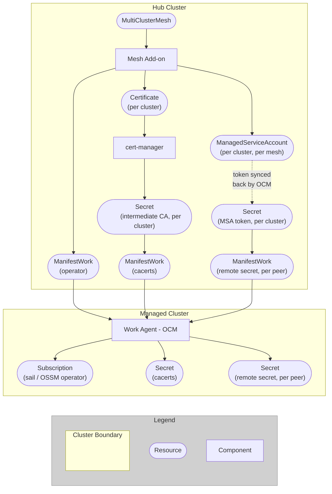

# Design

## Table of Contents

- [Overview](#overview)
- [Architecture](#architecture)
- [Scope](#scope)
- [Supported Topologies](#supported-topologies)
- [Custom Resource](#custom-resource)
- [Cluster Selection and Multi-Tenancy](#cluster-selection-and-multi-tenancy)
- [Operator Lifecycle](#operator-lifecycle)
- [Trust Distribution](#trust-distribution)
- [Endpoint Discovery](#endpoint-discovery)
- [Phased Approach](#phased-approach)

## Overview

The OCM Service Mesh Add-on automates multi-cluster Istio service mesh setup via [OCM]. It manages the `MultiClusterMesh` custom resource on the hub cluster to orchestrate three concerns across managed clusters:

1. **Operator Lifecycle** - Installing and managing the [Sail]/OSSM operator
2. **Trust Distribution** - Establishing mTLS trust via [cert-manager]
3. **Endpoint Discovery** - Exchanging discovery credentials via [ManagedServiceAccount]

Without this add-on, multi-cluster mesh setup is a manual process involving certificate management, O(N^2) secret exchanges, and per-cluster operator configuration.

## Architecture

The add-on follows OCM's hub-and-spoke model:

- **Hub**: Manages `MultiClusterMesh` resources, creates [ManifestWorks][ManifestWork], orchestrates cert-manager and ManagedServiceAccount
- **Spoke** (managed clusters): Receives ManifestWorks from the hub, runs the Sail/OSSM operator and Istio control plane




## Scope

### What the add-on does (Plumbing)

- Installs the Sail/OSSM operator on managed clusters via OLM
- Distributes intermediate CA certificates for mTLS trust
- Exchanges discovery tokens between peer clusters
- Handles lifecycle events (cluster add/remove, mesh creation/deletion)

### What the add-on does not do (Configuration)

- Does not create or manage Istio custom resources (the user or GitOps owns this)
- Does not patch existing Istio CRs on spoke clusters (this would conflict with ArgoCD/GitOps reconciliation)
- Does not enforce control plane version consistency across clusters
- Does not deploy monitoring, observability, or application workloads
- Does not create AuthorizationPolicies or other application-level security config
- Does not adopt pre-existing mesh deployments (brownfield)

## Supported Topologies

The MVP supports the [Multi-Primary Multi-Network] mesh topology. This aligns with OCM's model where each cluster runs its own control plane. Support for other topologies (e.g., Primary-Remote, External Control Plane) can be added with backwards-compatible API changes.

## Custom Resource

`MultiClusterMesh` is a namespaced resource. The namespace provides tenant isolation on the hub.

### Key Fields

| Field | Required | Description |
|-------|----------|-------------|
| `spec.clusterSet` | Yes | Name of the [ManagedClusterSet] defining cluster membership |
| `spec.controlPlane.namespace` | No | Namespace where Istio is installed on each cluster (default: `istio-system`) |
| `spec.operator.namespace` | No | Namespace where the operator is installed (default: `openshift-operators` on OCP, `sail-operator` on K8s) |
| `spec.operator.channel` | No | OLM subscription channel (default: `stable`) |
| `spec.operator.source` | No | CatalogSource name (default: `redhat-operators` on OCP, `operatorhubio-catalog` on K8s) |
| `spec.operator.sourceNamespace` | No | CatalogSource namespace (default: `openshift-marketplace` on OCP, `olm` on K8s) |
| `spec.operator.startingCSV` | No | Pin to a specific operator version |
| `spec.operator.installPlanApproval` | No | `Automatic` or `Manual` (default: `Automatic`) |
| `spec.security.trust.certManager.issuerRef.name` | No | cert-manager Issuer name for Root CA |
| `spec.security.discovery.tokenValidity` | No | ManagedServiceAccount token lifetime (default: `1m`) |

### Example

```yaml
apiVersion: mesh.open-cluster-management.io/v1alpha1
kind: MultiClusterMesh
metadata:
  name: prod-mesh
  namespace: mesh-team-a
spec:
  clusterSet: finance-prod
  controlPlane:
    namespace: istio-system
  operator:
    channel: "stable"
    source: redhat-operators
    sourceNamespace: openshift-marketplace
  security:
    trust:
      certManager:
        issuerRef:
          name: mesh-root-issuer
    discovery:
      tokenValidity: "1w"
```

## Cluster Selection and Multi-Tenancy

The add-on uses OCM [ManagedClusterSet] with `ExclusiveClusterSetLabel` as the unit of mesh membership. A cluster can only belong to one ClusterSet at a time.

`MultiClusterMesh` is namespace-scoped, enabling tenant isolation on the hub. Each mesh operates independently - its certificates, discovery tokens, and operator configuration are scoped to its namespace. No two meshes may manage the same control plane namespace on the same ClusterSet. If a conflict is detected, the older resource (by creation timestamp) wins and the newer one is rejected.

The add-on detects the cluster platform via [OCM cluster claims][ClusterClaim]. OpenShift variants (OCP, ROSA, ARO, ROKS, OSD) get OSSM with OCP-specific defaults. Vanilla Kubernetes gets the Sail operator with upstream defaults. Detection happens per-cluster, so mixed ClusterSets work correctly.

## Operator Lifecycle

The Sail/OSSM operator is a cluster-scoped singleton - only one instance can run per cluster. The operator is therefore a **shared resource** across meshes, not owned by any individual mesh. Multiple meshes targeting the same cluster share the operator installation. Cleanup only occurs when no mesh targets a cluster anymore.

The add-on follows a **Do No Harm** strategy: it never forcibly uninstalls or downgrades an existing operator. If the operator is already present with a compatible configuration, the add-on adopts it. If there's a conflict (e.g., different channel), the add-on reports an error and halts reconciliation for that cluster.

The add-on does not validate OpenShift version compatibility with the requested operator channel. It delegates this to OLM - if a cluster's OCP version is incompatible with the requested operator version, the OLM installation will stall, preventing the cluster from joining the mesh with an unsupported control plane.

## Trust Distribution

Trust distribution requires [cert-manager] to be installed on the hub cluster. The user is responsible for setting up cert-manager and creating the `Issuer` resource that acts as the Root CA.

The add-on implements Istio's [Plug-in CA] pattern:

1. A cert-manager `Issuer` in the mesh namespace acts as the Root CA (user-provisioned)
2. The add-on creates per-cluster `Certificate` resources, yielding intermediate CAs
3. Intermediate CAs are distributed to managed clusters as `cacerts` secrets in the control plane namespace
4. The root CA private key never leaves the hub

The trust domain is derived from the mesh name (one trust domain per mesh, not per cluster). This simplifies multi-cluster mTLS - all clusters in a mesh share the same trust domain, so workloads can authenticate across clusters without additional configuration.

Certificate rotation is handled automatically by cert-manager. Updated certificates are propagated to clusters when they change.

## Endpoint Discovery

For multi-primary mesh topologies, each control plane needs API access to its peers. The add-on automates this using [ManagedServiceAccount]:

1. Creates a `ManagedServiceAccount` per cluster per mesh, yielding short-lived tokens
2. Constructs kubeconfig-style remote secrets from these tokens
3. Distributes remote secrets to all peer clusters in the mesh
4. Token rotation is handled automatically by the OCM platform

## Phased Approach

**Phase 1 (MVP)**: "Lean" approach - the add-on handles plumbing (operator, certificates, discovery).

The user is responsible for:

- Creating and managing Istio custom resources on each spoke cluster (directly or via GitOps)
- Enabling Istio CNI on OpenShift clusters
- Configuring `discoverySelectors` in multi-tenant environments to prevent cross-mesh service visibility
- Labeling application namespaces to match discovery selector configuration

ArgoCD with ApplicationSets is the recommended approach for managing Istio configuration across clusters.

**Phase 2 (Future)**: "Full" approach - the add-on also manages Istio custom resources centrally, automating topology configuration and enforcing consistency.

<!-- Reference links -->
[OCM]: https://open-cluster-management.io/
[Sail]: https://github.com/istio-ecosystem/sail-operator
[cert-manager]: https://cert-manager.io/
[ManagedServiceAccount]: https://open-cluster-management.io/docs/getting-started/integration/managed-serviceaccount/
[ManifestWork]: https://open-cluster-management.io/docs/concepts/work-distribution/manifestwork/
[ManagedClusterSet]: https://open-cluster-management.io/docs/concepts/cluster-inventory/managedclusterset/
[ClusterClaim]: https://open-cluster-management.io/docs/concepts/cluster-inventory/clusterclaim/
[Plug-in CA]: https://istio.io/latest/docs/tasks/security/cert-management/plugin-ca-cert/
[Multi-Primary Multi-Network]: https://istio.io/latest/docs/setup/install/multicluster/multi-primary_multi-network/
