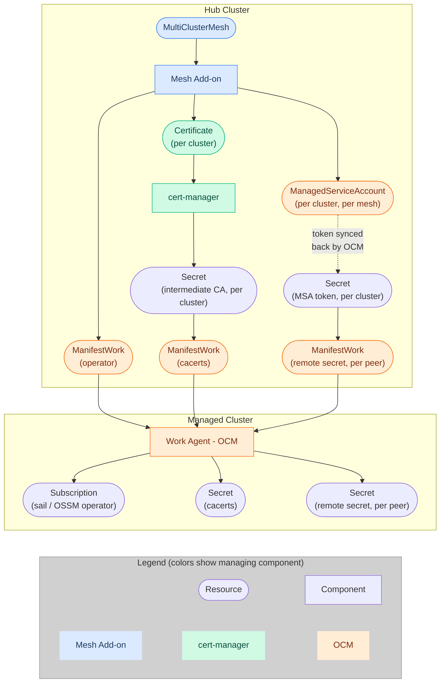

# Design

## Table of Contents

- [Overview](#overview)
- [Architecture](#architecture)
- [Scope](#scope)
- [Supported Topologies](#supported-topologies)
- [Custom Resource](#custom-resource)
- [Cluster Selection and Multi-Tenancy](#cluster-selection-and-multi-tenancy)
- [Operator Lifecycle](#operator-lifecycle)
- [Trust Distribution](#trust-distribution)
- [Endpoint Discovery](#endpoint-discovery)
- [Lifecycle Events](#lifecycle-events)
- [Phased Approach](#phased-approach)

## Overview

The OCM Service Mesh Add-on automates multi-cluster Istio service mesh setup via [OCM]. It manages the `MultiClusterMesh` custom resource on the hub cluster to orchestrate three concerns across managed clusters:

1. **Operator Lifecycle** - Installing and managing the service mesh operator ([OSSM]/[Sail])
2. **Trust Distribution** - Establishing mTLS trust via [cert-manager]
3. **Endpoint Discovery** - Exchanging discovery credentials via [ManagedServiceAccount]

Without this add-on, multi-cluster mesh setup is a manual process involving certificate management, O(N^2) secret exchanges, and per-cluster operator configuration.

## Architecture

The add-on follows OCM's hub-and-spoke model:

- **Hub**: The Mesh Add-on controller watches `MultiClusterMesh` resources and creates [ManifestWorks][ManifestWork], orchestrates cert-manager and ManagedServiceAccount
- **Spoke** (managed clusters): Receives ManifestWorks from the hub, runs the service mesh operator and Istio control plane

A [ClusterManagementAddOn] resource is deployed to register this addon with OCM's addon manager, but the addon uses manual installation strategy and does not leverage the framework's lifecycle management features (auto-deployment, per-cluster enable/disable via `ManagedClusterAddOn`).




## Scope

### What the add-on does (Plumbing)

- Installs the service mesh operator (OSSM by default) on managed clusters via OLM
- Distributes intermediate CA certificates for mTLS trust
- Exchanges discovery tokens between peer clusters
- Handles lifecycle events (cluster add/remove, mesh creation/deletion)

### What the add-on does not do (Configuration)

- Does not create or manage Istio custom resources (the user or GitOps owns this)
- Does not patch existing Istio CRs on spoke clusters (this would conflict with ArgoCD/GitOps reconciliation)
- Does not enforce control plane version consistency across clusters
- Does not deploy monitoring, observability, or application workloads
- Does not create AuthorizationPolicies or other application-level security config
- Does not integrate with ACM addon lifecycle (enable/disable via `ManagedClusterAddOn` and such)
- Does not adopt pre-existing mesh deployments (brownfield). Note: the add-on *does* adopt pre-existing operator installations (see [Collision Handling](#collision-handling)). This non-goal refers specifically to adopting an existing mesh configuration and trust root.

## Supported Topologies

The MVP supports the [Multi-Primary Multi-Network] mesh topology. This aligns with OCM's model where each cluster runs its own control plane. Support for other topologies (e.g., Primary-Remote, External Control Plane) can be added with backwards-compatible API changes.

## Custom Resource

`MultiClusterMesh` is a namespaced resource. The namespace provides tenant isolation on the hub.
The resource name (`metadata.name`) is limited to 63 characters because it is used in X.509 certificate subject fields and Kubernetes label values.

### Key Fields

| Field | Required | Description |
|-------|----------|-------------|
| `spec.clusterSet` | Yes | Name of the [ManagedClusterSet] defining cluster membership (immutable after creation) |
| `spec.controlPlane.namespace` | No | Namespace where Istio is installed on each cluster (default: `istio-system`) |
| `spec.operator.name` | No | OLM package name (default: `servicemeshoperator3`) |
| `spec.operator.namespace` | No | Namespace where the operator is installed (default: `multicluster-mesh-operator`) |
| `spec.operator.channel` | No | OLM subscription channel (default: `stable`) |
| `spec.operator.source` | No | CatalogSource name (default: `redhat-operators`) |
| `spec.operator.sourceNamespace` | No | CatalogSource namespace (default: `openshift-marketplace`) |
| `spec.operator.startingCSV` | No | Pin to a specific operator version |
| `spec.operator.installPlanApproval` | No | `Automatic` or `Manual` (default: `Automatic`) |
| `spec.security.trust.certManager.issuerRef.name` | No | cert-manager Issuer name for Root CA |
| `spec.security.trust.certManager.issuerRef.kind` | No | Kind of the cert-manager issuer (`Issuer` or `ClusterIssuer`, default: `Issuer`) |
| `spec.security.discovery.tokenValidity` | No | ManagedServiceAccount token lifetime (default: `360h`, minimum value: `10m`) |

### Example

```yaml
apiVersion: mesh.open-cluster-management.io/v1alpha1
kind: MultiClusterMesh
metadata:
  name: prod-mesh
  namespace: mesh-team-a
spec:
  clusterSet: finance-prod
  controlPlane:
    namespace: istio-system
  operator:
    name: servicemeshoperator3
    channel: "stable"
    source: redhat-operators
    sourceNamespace: openshift-marketplace
  security:
    trust:
      certManager:
        issuerRef:
          name: mesh-root-issuer
          kind: Issuer
    discovery:
      tokenValidity: "168h"
```

## Cluster Selection and Multi-Tenancy

The add-on uses OCM [ManagedClusterSet] with `ExclusiveClusterSetLabel` as the unit of mesh membership. A cluster can only belong to one ClusterSet at a time.

The `spec.clusterSet` field is immutable after creation. With exclusive ClusterSets, changing the reference means an entirely different set of clusters. All plumbing is cluster-specific, so nothing carries over, making migration equivalent to deleting and recreating the mesh. Users who need a different ClusterSet should delete the mesh CR and create a new one.

`MultiClusterMesh` is namespace-scoped, enabling tenant isolation on the hub. Each mesh operates independently - its certificates, discovery tokens, and operator configuration are scoped to its namespace. Multiple meshes can target the same ClusterSet, provided they use different control plane namespaces. For example, Mesh A targets ClusterSet X with namespace `istio-system-a`, while Mesh B targets the same ClusterSet X with namespace `istio-system-b`. Each mesh gets its own trust domain, certificates, and discovery tokens. If two meshes target the same control plane namespace on the same ClusterSet, the older resource (by creation timestamp) wins and the newer one is rejected.

The add-on defaults to OSSM (OpenShift Service Mesh) operator configuration. All `spec.operator` fields can be overridden to use a different operator (e.g., upstream Sail on non-OCP clusters).

Plumbing resources (ManifestWorks, ManagedServiceAccounts) must use a deterministic naming strategy scoped to the owning mesh, so that multiple meshes on the same cluster don't collide. The operator ManifestWork is an exception - it is shared across meshes since the operator is a cluster-wide singleton. See [#72] for the naming convention discussion.

## Operator Lifecycle

The service mesh operator is a cluster-scoped singleton - only one instance can run per cluster. The operator is therefore a **shared resource** across meshes, not owned by any individual mesh. Multiple meshes targeting the same cluster share the operator installation. Cleanup is scoped to the ClusterSet: when a cluster is no longer needed by any mesh in its ClusterSet, the operator ManifestWork is removed. If the cluster moves to a different ClusterSet with a mesh, the new mesh bootstraps a fresh operator installation with its own configuration.

The add-on follows a **Do No Harm** strategy: it never forcibly uninstalls or downgrades an existing operator. If the operator is already present with a compatible configuration, the add-on adopts it. If there's a conflict (e.g., different channel), the add-on reports an error and halts reconciliation for that cluster.

### Installation Workflow

1. **Pre-existing operator detection**: The controller creates a [ManagedClusterView] to check if a Sail/OSSM Subscription already exists on the managed cluster. This is necessary because ManifestWork claims ownership of any resource it applies, and deleting the ManifestWork would remove a pre-existing Subscription, potentially disrupting other components that depend on it (e.g., OpenShift Gateway API).
2. **Adoption (operator already present)**: If a compatible Subscription is found, the add-on skips ManifestWork creation. If the configuration is incompatible, the add-on reports a conflict.
3. **Installation (operator missing)**: If no Subscription is found, the controller creates a [ManifestWork] containing the OLM objects (Namespace, OperatorGroup, Subscription). The operator is installed in a dedicated namespace (`multicluster-mesh-operator` by default) so that removing the mesh cleanly removes all operator resources including the CSV.

### Collision Handling

The controller handles two types of collisions:

1. **Hub-side (between meshes)**: If two `MultiClusterMesh` resources target the same cluster but request different operator configurations (e.g., different channels or catalog sources), the oldest mesh (by creation timestamp) takes precedence. Newer meshes with conflicting configs are halted with a `ConfigurationConflict` status.
2. **Spoke-side (pre-existing operator)**: If the ManagedClusterView detects an existing Subscription not created by the add-on, the controller compares the installed configuration against the mesh's `spec.operator`. If compatible, the operator is adopted. If incompatible, the controller halts and reports a `ConfigurationConflict`.

In both cases, the add-on will never forcibly uninstall, downgrade, or overwrite an existing operator. The user must resolve conflicts manually.

The add-on does not validate OpenShift version compatibility with the requested operator channel. It delegates this to OLM - if a cluster's OCP version is incompatible with the requested operator version, the OLM installation will stall, preventing the cluster from joining the mesh with an unsupported control plane.

## Trust Distribution

Trust distribution requires [cert-manager] to be installed on the hub cluster. The user is responsible for setting up cert-manager and creating the `Issuer` or `ClusterIssuer` resource that acts as the Root CA.

The add-on implements Istio's [Plug-in CA] pattern:

1. A cert-manager `Issuer` or `ClusterIssuer` acts as the Root CA (user-provisioned)
2. The add-on creates per-cluster `Certificate` resources, yielding intermediate CAs
3. Intermediate CAs are distributed to managed clusters as `cacerts` secrets in the control plane namespace
4. The root CA private key never leaves the hub

The trust domain is derived from the mesh name (one trust domain per mesh, not per cluster). In Phase 1, this is a naming convention: the controller sets the certificate CN accordingly, but the user must configure the matching `trustDomain` in their Istio CR. This simplifies multi-cluster mTLS - all clusters in a mesh share the same trust domain, so workloads can authenticate across clusters without additional configuration.

Certificate rotation is handled automatically by cert-manager. Updated certificates are propagated to clusters when they change.

## Endpoint Discovery

For multi-primary mesh topologies, each control plane needs API access to its peers. The add-on automates this using [ManagedServiceAccount]:

1. Creates a `ManagedServiceAccount` per cluster per mesh, yielding short-lived tokens. See [#72] for the naming convention discussion.
2. Constructs kubeconfig-style remote secrets from these tokens
3. Distributes remote secrets to all peer clusters in the mesh
4. Token rotation is handled automatically by the OCM platform
5. When a cluster is removed from the mesh, its MSA is deleted and its remote secrets are removed from all peers

## Lifecycle Events

- **Scale Up**: When a new cluster joins the ClusterSet, the controller automatically provisions the mesh plumbing for it: installs the operator, mints an intermediate CA, and distributes discovery tokens to all peers. This is the same process as the initial mesh bootstrap, applied incrementally to the new cluster.
- **Scale Down**: When a cluster is removed from a set, the controller immediately revokes its access by removing the remote secrets from all peer clusters and cleaning up the local CA bundles.

## Phased Approach

**Phase 1 (MVP)**: "Lean" approach - the add-on handles plumbing (operator, certificates, discovery).

The user is responsible for:

- Creating and managing Istio custom resources on each spoke cluster (directly or via GitOps)
- Enabling Istio CNI on OpenShift clusters
- Configuring `discoverySelectors` in multi-tenant environments to prevent cross-mesh service visibility
- Labeling application namespaces to match discovery selector configuration

ArgoCD with ApplicationSets is the recommended approach for managing Istio configuration across clusters.

**Phase 2 (Future)**: "Full" approach - the add-on also manages Istio custom resources centrally, automating topology configuration and enforcing consistency.

Potential additions include observability stack management and full addon framework integration (leveraging `ManagedClusterAddOn` for per-cluster enable/disable).

<!-- Reference links -->
[OCM]: https://open-cluster-management.io/
[OSSM]: https://docs.openshift.com/service-mesh/
[Sail]: https://github.com/istio-ecosystem/sail-operator
[cert-manager]: https://cert-manager.io/
[ManagedServiceAccount]: https://open-cluster-management.io/docs/getting-started/integration/managed-serviceaccount/
[ManifestWork]: https://open-cluster-management.io/docs/concepts/work-distribution/manifestwork/
[ManagedClusterSet]: https://open-cluster-management.io/docs/concepts/cluster-inventory/managedclusterset/
[ClusterClaim]: https://open-cluster-management.io/docs/concepts/cluster-inventory/clusterclaim/
[ManagedClusterView]: https://github.com/stolostron/cluster-lifecycle-api
[ClusterManagementAddOn]: https://open-cluster-management.io/docs/concepts/addon/#clustermanagementaddon
[Plug-in CA]: https://istio.io/latest/docs/tasks/security/cert-management/plugin-ca-cert/
[Multi-Primary Multi-Network]: https://istio.io/latest/docs/setup/install/multicluster/multi-primary_multi-network/
[#72]: https://github.com/stolostron/multicluster-mesh-addon/issues/72
