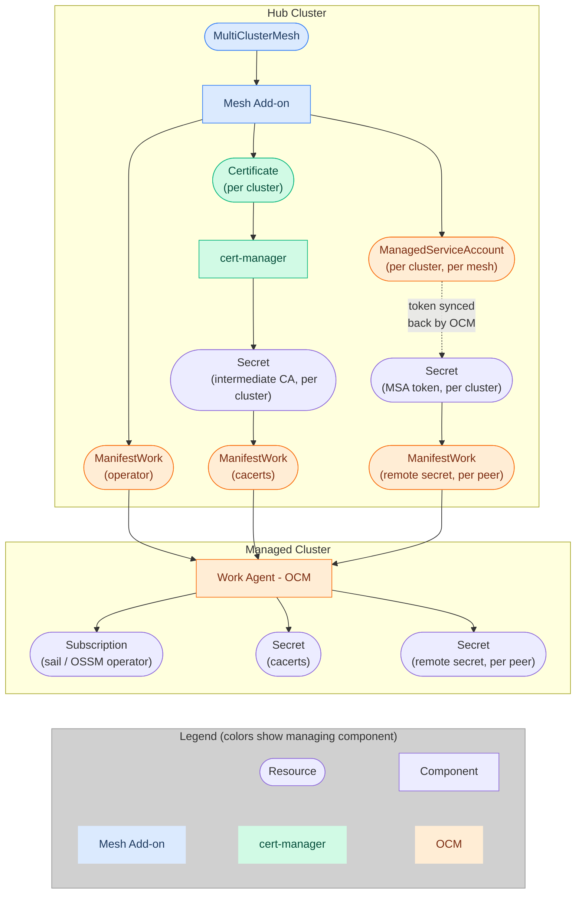

# Design

## Table of Contents

- [Overview](#overview)
- [Approach Comparison](#approach-comparison)
- [Architecture](#architecture)
- [Scope](#scope)
- [Supported Topologies](#supported-topologies)
- [Custom Resource](#custom-resource)
- [Cluster Selection and Multi-Tenancy](#cluster-selection-and-multi-tenancy)
- [Operator Lifecycle](#operator-lifecycle)
- [Trust Distribution](#trust-distribution)
- [Endpoint Discovery](#endpoint-discovery)
- [Lifecycle Events](#lifecycle-events)
- [Phased Approach](#phased-approach)

## Overview

The OCM Service Mesh Add-on automates multi-cluster Istio service mesh setup via [OCM]. It manages the `MultiClusterMesh` custom resource on the hub cluster to orchestrate three concerns across managed clusters:

1. **Operator Lifecycle** - Installing and managing the service mesh operator ([OSSM]/[Sail])
2. **Trust Distribution** - Establishing mTLS trust via [cert-manager]
3. **Endpoint Discovery** - Exchanging discovery credentials via [ManagedServiceAccount]

Without this add-on, multi-cluster mesh setup is a manual process involving certificate management, O(N^2) secret exchanges, and per-cluster operator configuration.

## Approach Comparison

Multi-cluster Istio mesh can be set up in several ways, from fully manual to policy-driven to addon-managed.
Each approach trades off flexibility against operational complexity, error-proneness, and safety at scale.
The table below compares three approaches across operational concerns:

- **Manual**: the user provisions all resources directly using `kubectl`, `istioctl`, and scripting or GitOps tooling (e.g., ArgoCD `ApplicationSets`).
Maximum flexibility, maximum burden.
GitOps can automate distribution and drift detection for the resources you define, but it cannot compute derived resources (peer graphs, per-cluster certificates) or validate domain-specific constraints.
- **OCM Policies**: the user authors [governance policies][Policy Framework] with hub templates to automate resource distribution across clusters.
The policy framework handles targeting and compliance, but the user is responsible for authoring, maintaining, and debugging the policy stack.
- **Addon Controller**: the user creates a single `MultiClusterMesh` CR.
The addon controller orchestrates the full mesh lifecycle (operator, certificates, discovery, and Istio control plane rollout) with domain-aware validation, conflict detection, and lifecycle management.

> **Note on phased scope:** The comparison below reflects the addon's full intended scope, including centralized `Istio` CR management (see [Phased Approach](#phased-approach)).
>
> In Phase 1 (MVP), the addon manages plumbing only (operator, trust, discovery).
> `Istio` CR rollout (control plane, `IstioCNI`, gateways) remains the user's responsibility and can be handled via any of the approaches above (manual, GitOps, or OCM policies).
>
> The addon's advantages in Phase 1 apply to plumbing concerns.
> For `Istio` CR management concerns, the Phase 1 user experience is closer to the manual or policy columns.

### Setup and Day-1 Operations

| Concern | Manual | OCM Policies | Addon Controller |
|---------|--------|--------------|------------------|
| **Initial setup** | **Very high complexity.** 4 per-cluster operations (namespace, control plane, gateway, expose services) + N×(N−1) remote secret exchanges. At 10 clusters: ~130 operations. | **Medium complexity.** Author ~8 policies, set up supporting resources (`ManagedClusterSetBinding`, `Placements`, `PolicySets`, `PlacementBindings`, RBAC for `managedclustersets/bind`). One-time effort, but requires hub template syntax, policy semantics, and Istio architecture knowledge. | **Low complexity.** One CR covers the full mesh lifecycle: operator, trust, discovery, and Istio control plane rollout. |
| **Adding clusters** | **High complexity.** Repeat per-cluster steps. Adding one cluster to an N-cluster mesh requires 2×(N−1) remote secret operations plus operator, certs, and namespace setup. | **Low complexity.** Add a label. The new cluster is automatically provisioned. | **Low complexity.** Add the cluster to the `ClusterSet`. The new cluster is automatically provisioned. |
| **Removing clusters** | **High complexity.** Revoke remote secrets from all N−1 peers, clean up certs, optionally remove operator. Easy to miss a peer. | **Low complexity.** Remove a label. Resources are cleaned up automatically, though depending on how policies are authored, some may be left behind (e.g., namespaces, CRDs). | **Low complexity.** Automatic cleanup and prompt access revocation across all peers. |
| **Setup reliability** | **Low.** Fragile: a single wrong label, typo, or outdated guide step means debugging across N clusters with no clear error. Istio failures are often silent. GitOps helps with drift but doesn't catch Istio-specific misconfigurations. | **Medium.** Compliance reporting tells you something is wrong, but doesn't diagnose Istio-specific misconfigurations (wrong network label, cert chain mismatch). Template authoring errors can be hard to debug. | **High.** Validates inputs and catches Istio-specific misconfigurations (wrong network label, missing CNI, version skew, `discoverySelectors` overlap) in addition to plumbing errors. Reports domain-specific errors. Reduces the surface area for mistakes to the CRD spec. |

### Trust and Credential Management

| Concern | Manual | OCM Policies | Addon Controller |
|---------|--------|--------------|------------------|
| **Certificate distribution** | **High complexity.** Generate root CA, keep root key secure, generate per-cluster intermediates, distribute manually. No built-in Istio tooling for this. | **Medium complexity.** Policies can distribute CA material. Per-cluster intermediate CAs require cert-manager + additional hub-side `Certificate` management. Without cert-manager, user provides CA material manually. | **Low complexity.** Per-cluster intermediate CAs via cert-manager. Root key never leaves hub. Automatic propagation. |
| **Zero-downtime trust rotation** | **Difficult.** Requires a multi-step overlapping trust bundle approach across all clusters. Istio does not provide a turnkey procedure. Skipping steps or mistiming breaks cross-cluster mTLS. | **Possible but manual.** Policies can distribute the trust bundles, but the admin must manually coordinate the steps (distribute combined bundle, verify all clusters received it, then switch signing). A simpler approach (just replace the cert) works but risks downtime if clusters pick up the new cert at different times. | **Controller-orchestrated.** The controller can coordinate the multi-step rotation across clusters (distribute combined bundle, verify propagation, switch signing). The operation itself still depends on Istio's trust renewal timing, but the coordination is the kind of sequenced, cluster-aware work that a controller handles naturally and is hard to express in declarative policies. |
| **N-to-N discovery** | **Very high complexity, grows quadratically.** `istioctl create-remote-secret` works one cluster pair at a time with no batch mode. N×(N−1) manual invocations for a full mesh. | **Medium complexity.** A single policy can generate remote secrets for all cluster pairs automatically. Non-trivial to author and maintain. | **Low complexity.** Automatic peer discovery and credential exchange. |
| **Discovery credential rotation** | **High effort, risk of outage.** Regenerate tokens, rebuild kubeconfigs, redistribute all remote secrets manually. If the admin misses the rotation window, tokens expire and clusters lose cross-cluster discovery until manually fixed. | **Automatic, minimal risk.** `ManagedServiceAccount` handles token rotation. Policies pick up the new token and update remote secrets well before the old token expires. | **Automatic, minimal risk.** `ManagedServiceAccount` handles token rotation. Controller picks up the new token and updates remote secrets. Functionally similar to the policy path. |

### Safety and Correctness

| Concern | Manual | OCM Policies | Addon Controller |
|---------|--------|--------------|------------------|
| **Conflict detection** | **High risk.** Conflicts discovered at runtime. No warning before damage (e.g., two `Subscriptions` fighting, OCP Gateway API operator collision on 4.19-4.21). | **Medium risk.** Compliance shows NonCompliant but no domain-aware diagnosis. No cross-policy conflict detection: competing policies result in last-write-wins. `OperatorPolicy` silently overwrites pre-existing `Subscription` fields. | **Low risk.** Do-no-harm strategy: detects pre-existing operators before touching them, compares configs, detects cross-mesh conflicts. Reports specific error reasons. |
| **Guardrails** | **None.** User can create invalid configurations with no warning. | **Generic.** Compliance reports resource drift, but doesn't understand Istio semantics. Won't warn about version skew, `discoverySelectors` overlap, or `IstioCNI` conflicts between meshes. | **Domain-aware.** Validates operator compatibility, namespace uniqueness, `ClusterSet` exclusivity, `discoverySelectors` isolation, and control plane version alignment. Guides without babysitting. |
| **Configuration integrity** | **None.** Any mesh resource can be modified or deleted with no automatic correction. Credentials (certs, tokens) spread across N clusters with no centralized tracking. | **Partial.** Policies auto-remediate drift on resources they manage. Modifying the policy itself (the source of truth) is not guarded by any higher-level mechanism. | **Self-healing.** Controller auto-corrects rogue changes to all managed resources. The `MultiClusterMesh` CRD is the single source of truth, with validations (immutable `spec.clusterSet`, field constraints) guarding against invalid changes. |

### Scaling and Multi-Tenancy

| Concern | Manual | OCM Policies | Addon Controller |
|---------|--------|--------------|------------------|
| **Operational complexity at scale** | **Untenable.** Istio docs say "managing configuration across multiple clusters at scale is challenging." Manageable for a handful of clusters, impractical beyond that. | **Manageable for single mesh.** User effort stays constant per mesh regardless of cluster count. Multi-mesh multiplies the policy surface area the user maintains and debugs. | **Constant.** One CR per mesh regardless of cluster count or mesh count. |
| **Multi-mesh / multi-tenancy** | **Very high complexity.** Every concern multiplied by mesh count. User must manually ensure isolation (namespaces, `discoverySelectors`, `IstioCNI` singleton). | **High complexity.** Requires duplicating policies per mesh or complex parameterization. No cross-mesh validation. Cluster-scoped singletons (`IstioCNI`, operator) become conflict points with no framework-level resolution. | **Reduced complexity.** Namespace-scoped CRs provide tenant isolation on the hub. `ClusterSet` boundaries and hub-side ownership rules reduce overlap risks. The addon detects cross-mesh conflicts for operator, namespaces, `discoverySelectors`, and control plane resources. |

### Flexibility and Day-2 Operations

| Concern | Manual | OCM Policies | Addon Controller |
|---------|--------|--------------|------------------|
| **Flexibility / customization** | **Maximum.** Most flexible, most headache. | **Medium-high.** Per-cluster customization is limited to what the hub template supports. Non-uniform topologies (e.g., primary-remote where one cluster is fundamentally different) require complex conditional branching in templates. Each new use case means more template logic to maintain. | **Constrained for plumbing, flexible for configuration.** Operator and trust config is parameterized within supported boundaries. `Istio` CR management provides sensible defaults with per-cluster overrides. |
| **Istio CR management** | **Full control, full responsibility.** | **Full control with automation.** Can distribute `Istio`, `IstioCNI`, and gateways with per-cluster templating. | **Centralized management** with domain-aware defaults, validation, and per-cluster overrides. See the phased scope note above for current coverage. |
| **Drift detection and compliance** | **Limited.** GitOps tooling can detect drift for resources it manages, but has no awareness of Istio-specific correctness. Without GitOps, none. | **Strong.** First-class compliance reporting with per-resource violation details. Configurable remediation (inform vs enforce). | **Domain-aware.** Reports specific error reasons for all managed resources. Compliance reporting is planned as the addon matures. |

### User Experience

| Concern | Manual | OCM Policies | Addon Controller |
|---------|--------|--------------|------------------|
| **Learning curve** | **Low entry, high ongoing.** Familiar tools (`kubectl`, `openssl`, `istioctl`). But the ongoing knowledge burden is high: Istio multi-cluster architecture, cert management, discovery lifecycle. | **High entry, transferable.** Must learn the OCM policy framework (hub templates, compliance types, evaluation intervals, `PolicySets`, `PlacementBindings`) in addition to Istio. The policy knowledge is transferable to other governance use cases, but learning it solely for mesh deployment is a high upfront cost. | **Low.** User interacts with a single CRD. Internal complexity is abstracted. |
| **Debugging / troubleshooting** | **High effort.** User debugs across N clusters independently with no centralized view. | **Medium effort.** Compliance reporting aggregates state and identifies non-compliant clusters. If deeper debugging is needed, the user traces through the policy stack. | **Low effort.** Per-cluster status conditions on a single CR with specific error reasons. If the user needs to dig deeper into the distribution mechanism, the complexity is similar to manual policies. |
| **Prerequisites** | **Minimal.** `kubectl`, `openssl`/`cfssl`, `istioctl`. Tools most users already have. | **OCM policy framework** + `ManagedServiceAccount` addon. cert-manager optional (needed for automated per-cluster CA generation, otherwise user provides CA material manually). | **cert-manager** + `ManagedServiceAccount` addon + the addon itself. |

### Summary

The comparison above describes each approach at its full intended scope (see the phased scope note above for current coverage).

For **production and semi-production environments**, the addon controller is the recommended approach.
It handles the hardest parts of multi-cluster mesh management (trust distribution, N-to-N discovery, conflict detection, credential rotation) while keeping the user's interaction surface to a single CR.
The domain-aware validation and do-no-harm strategy prevent classes of errors that the other approaches can't detect.

**OCM policies** are a production-capable approach for **single-mesh deployments** when the team has policy framework expertise and accepts the tradeoffs.
The compliance reporting and drift detection are genuine strengths, and policies can manage the full Istio stack including control plane CRs.
However, the lack of cross-policy conflict detection, the difficulty of orchestrating multi-phase operations (such as zero-downtime CA rotation), and the complexity of multi-mesh management are significant limitations that users should evaluate for their use case.
Policies can also complement the addon for `Istio` CR distribution while the addon handles plumbing (see the phased scope note above).

**Manual setup** (with or without GitOps) offers the most granularity and is appropriate for **learning, experimentation, or environments where the addon cannot run** (no OCM, no cert-manager).
GitOps tooling helps with distribution and drift detection for defined resources, but cannot compute derived resources (peer graphs, per-cluster certificates) or validate Istio-specific constraints.
Beyond a few clusters, the quadratic growth in discovery operations and the fragility of the setup process make it the most operationally demanding option.

[Policy Framework]: https://open-cluster-management.io/docs/getting-started/integration/policy-controllers/

## Architecture

The add-on follows OCM's hub-and-spoke model:

- **Hub**: The Mesh Add-on controller watches `MultiClusterMesh` resources and creates [ManifestWorks][ManifestWork], orchestrates cert-manager and ManagedServiceAccount
- **Spoke** (managed clusters): Receives ManifestWorks from the hub, runs the service mesh operator and Istio control plane

A [ClusterManagementAddOn] resource is deployed to register this addon with OCM's addon manager, but the addon uses manual installation strategy and does not leverage the framework's lifecycle management features (auto-deployment, per-cluster enable/disable via `ManagedClusterAddOn`).


```mermaid
flowchart TD
    subgraph Hub Cluster
        mesh([MultiClusterMesh]) --> addon[Mesh Add-on]
        addon --> cert(["Certificate
        (per cluster)"])
        cert --> certmanager[cert-manager]
        addon --> msa(["ManagedServiceAccount
        (per cluster, per mesh)"])
        certmanager --> casecret(["Secret
        (intermediate CA, per cluster)"])
        msa -.->|"token synced
        back by OCM"| tokensecret(["Secret
        (MSA token, per cluster)"])
        addon --> mw_operator(["ManifestWork
        (operator)"])
        casecret --> mw_cacerts(["ManifestWork
        (cacerts)"])
        tokensecret --> mw_remote(["ManifestWork
        (remote secret, per peer)"])
    end

    subgraph Managed Cluster
        agent[Work Agent - OCM] --> subscription(["Subscription
        (sail / OSSM operator)"])
        agent --> cacerts(["Secret
        (cacerts)"])
        agent --> remotesecret(["Secret
        (remote secret, per peer)"])
    end

    mw_operator --> agent
    mw_cacerts --> agent
    mw_remote --> agent

    subgraph Legend[Legend #40;colors show managing component#41;]
        L1([Resource]) ~~~ L2[Component]
        C1[Mesh Add-on]:::addon ~~~ C2[cert-manager]:::certmgr ~~~ C3[OCM]:::ocm
    end

    %% fake link to make legend centered
    cacerts ~~~ Legend

    style Legend fill:#d0d0d0,stroke:#999,color:#333
    style C1 stroke:none
    style C2 stroke:none
    style C3 stroke:none

    %% Mesh Add-on managed (blue)
    classDef addon fill:#dbeafe,stroke:#3b82f6,color:#1e3a5f
    class addon,mesh addon

    %% cert-manager managed (green)
    classDef certmgr fill:#d1fae5,stroke:#10b981,color:#064e3b
    class certmanager,cert certmgr

    %% OCM managed (orange)
    classDef ocm fill:#ffedd5,stroke:#f97316,color:#7c2d12
    class agent,msa,mw_operator,mw_cacerts,mw_remote ocm

```


## Scope

### What the add-on does (Plumbing)

- Installs the service mesh operator (OSSM by default) on managed clusters via OLM
- Distributes intermediate CA certificates for mTLS trust
- Exchanges discovery tokens between peer clusters
- Handles lifecycle events (cluster add/remove, mesh creation/deletion)

### What the add-on does not do (Configuration) — Phase 1

The following are out of scope for Phase 1.
Some of these are planned for future phases (see [Phased Approach](#phased-approach) and [Approach Comparison](#approach-comparison)).

- Does not create or manage Istio custom resources (the user or GitOps owns this)
- Does not patch existing Istio CRs on spoke clusters (this would conflict with ArgoCD/GitOps reconciliation)
- Does not enforce control plane version consistency across clusters
- Does not deploy monitoring, observability, or application workloads
- Does not create AuthorizationPolicies or other application-level security config
- Does not integrate with ACM addon lifecycle (enable/disable via `ManagedClusterAddOn` and such)
- Does not adopt pre-existing mesh deployments (brownfield). Note: the add-on *does* adopt pre-existing operator installations (see [Collision Handling](#collision-handling)). This non-goal refers specifically to adopting an existing mesh configuration and trust root.

## Supported Topologies

The MVP supports the [Multi-Primary Multi-Network] mesh topology. This aligns with OCM's model where each cluster runs its own control plane. Support for other topologies (e.g., Primary-Remote, External Control Plane) can be added with backwards-compatible API changes.

### Network Partitioning

In a multi-network mesh, each cluster's control plane namespace must be labeled with `topology.istio.io/network` so that istiod knows which network the cluster belongs to.
The controller reads this label from the `ManagedCluster` object on the hub.
If the label is not set, the controller falls back to using the cluster name as the network identifier.

```bash
kubectl label managedcluster cluster1 topology.istio.io/network=network-a
kubectl label managedcluster cluster2 topology.istio.io/network=network-b
```

## Custom Resource

`MultiClusterMesh` is a namespaced resource. The namespace provides tenant isolation on the hub.
The resource name (`metadata.name`) is limited to 63 characters because it is used in X.509 certificate subject fields and Kubernetes label values.

### Key Fields

| Field | Required | Description |
|-------|----------|-------------|
| `spec.clusterSet` | Yes | Name of the [ManagedClusterSet] defining cluster membership (immutable after creation) |
| `spec.controlPlane.namespace` | No | Namespace where Istio is installed on each cluster (default: `istio-system`) |
| `spec.operator.name` | No | OLM package name (default: `servicemeshoperator3`) |
| `spec.operator.namespace` | No | Namespace where the operator is installed (default: `multicluster-mesh-operator`) |
| `spec.operator.channel` | No | OLM subscription channel (default: `stable`) |
| `spec.operator.source` | No | CatalogSource name (default: `redhat-operators`) |
| `spec.operator.sourceNamespace` | No | CatalogSource namespace (default: `openshift-marketplace`) |
| `spec.operator.startingCSV` | No | Pin to a specific operator version |
| `spec.operator.installPlanApproval` | No | `Automatic` or `Manual` (default: `Automatic`) |
| `spec.security.trust.certManager.issuerRef.name` | No | cert-manager Issuer name for Root CA |
| `spec.security.trust.certManager.issuerRef.kind` | No | Kind of the cert-manager issuer (`Issuer` or `ClusterIssuer`, default: `Issuer`) |
| `spec.security.discovery.tokenValidity` | No | ManagedServiceAccount token lifetime (default: `360h`, minimum value: `10m`) |

### Example

```yaml
apiVersion: mesh.open-cluster-management.io/v1alpha1
kind: MultiClusterMesh
metadata:
  name: prod-mesh
  namespace: mesh-team-a
spec:
  clusterSet: finance-prod
  controlPlane:
    namespace: istio-system
  operator:
    name: servicemeshoperator3
    channel: "stable"
    source: redhat-operators
    sourceNamespace: openshift-marketplace
  security:
    trust:
      certManager:
        issuerRef:
          name: mesh-root-issuer
          kind: Issuer
    discovery:
      tokenValidity: "168h"
```

## Cluster Selection and Multi-Tenancy

The add-on uses OCM [ManagedClusterSet] with `ExclusiveClusterSetLabel` as the unit of mesh membership. A cluster can only belong to one ClusterSet at a time.

The `spec.clusterSet` field is immutable after creation. With exclusive ClusterSets, changing the reference means an entirely different set of clusters. All plumbing is cluster-specific, so nothing carries over, making migration equivalent to deleting and recreating the mesh. Users who need a different ClusterSet should delete the mesh CR and create a new one.

`MultiClusterMesh` is namespace-scoped, enabling tenant isolation on the hub. Each mesh operates independently - its certificates, discovery tokens, and operator configuration are scoped to its namespace. Multiple meshes can target the same ClusterSet, provided they use different control plane namespaces. For example, Mesh A targets ClusterSet X with namespace `istio-system-a`, while Mesh B targets the same ClusterSet X with namespace `istio-system-b`. Each mesh gets its own trust domain, certificates, and discovery tokens. If two meshes target the same control plane namespace on the same ClusterSet, the older resource (by creation timestamp) wins and the newer one is rejected.

The add-on defaults to OSSM (OpenShift Service Mesh) operator configuration. All `spec.operator` fields can be overridden to use a different operator (e.g., upstream Sail on non-OCP clusters).

Plumbing resources (ManifestWorks, ManagedServiceAccounts) must use a deterministic naming strategy scoped to the owning mesh, so that multiple meshes on the same cluster don't collide. The operator ManifestWork is an exception - it is shared across meshes since the operator is a cluster-wide singleton. See [#72] for the naming convention discussion.

## Operator Lifecycle

The service mesh operator is a cluster-scoped singleton - only one instance can run per cluster. The operator is therefore a **shared resource** across meshes, not owned by any individual mesh. Multiple meshes targeting the same cluster share the operator installation. Cleanup is scoped to the ClusterSet: when a cluster is no longer needed by any mesh in its ClusterSet, the operator ManifestWork is removed. If the cluster moves to a different ClusterSet with a mesh, the new mesh bootstraps a fresh operator installation with its own configuration.

The add-on follows a **Do No Harm** strategy: it never forcibly uninstalls or downgrades an existing operator. If the operator is already present with a compatible configuration, the add-on adopts it. If there's a conflict (e.g., different channel), the add-on reports an error and halts reconciliation for that cluster.

### Installation Workflow

1. **Pre-existing operator detection**: The controller creates a [ManagedClusterView] to check if a Sail/OSSM Subscription already exists on the managed cluster. This is necessary because ManifestWork claims ownership of any resource it applies, and deleting the ManifestWork would remove a pre-existing Subscription, potentially disrupting other components that depend on it (e.g., OpenShift Gateway API).
2. **Adoption (operator already present)**: If a compatible Subscription is found, the add-on skips ManifestWork creation. If the configuration is incompatible, the add-on reports a conflict.
3. **Installation (operator missing)**: If no Subscription is found, the controller creates a [ManifestWork] containing the OLM objects (Namespace, OperatorGroup, Subscription). The operator is installed in a dedicated namespace (`multicluster-mesh-operator` by default) so that removing the mesh cleanly removes all operator resources including the CSV.

### Collision Handling

The controller handles two types of collisions:

1. **Hub-side (between meshes)**: If two `MultiClusterMesh` resources target the same cluster but request different operator configurations (e.g., different channels or catalog sources), the oldest mesh (by creation timestamp) takes precedence. Newer meshes with conflicting configs are halted with a `ConfigurationConflict` status.
2. **Spoke-side (pre-existing operator)**: If the ManagedClusterView detects an existing Subscription not created by the add-on, the controller compares the installed configuration against the mesh's `spec.operator`. If compatible, the operator is adopted. If incompatible, the controller halts and reports a `ConfigurationConflict`.

In both cases, the add-on will never forcibly uninstall, downgrade, or overwrite an existing operator. The user must resolve conflicts manually.

The add-on does not validate OpenShift version compatibility with the requested operator channel. It delegates this to OLM - if a cluster's OCP version is incompatible with the requested operator version, the OLM installation will stall, preventing the cluster from joining the mesh with an unsupported control plane.

## Control Plane Namespace

The controller creates the control plane namespace (default: `istio-system`) on each managed cluster via ManifestWork.
The namespace is labeled with the cluster's network identity for istiod (see [Network Partitioning](#network-partitioning)).

The namespace ManifestWork is owned by the mesh, not shared across meshes.
Deleting the mesh deletes the namespace and everything in it on the spoke, including any Istio control plane resources the user deployed there.
Users should be aware that removing a mesh will clean up the entire control plane namespace on each cluster.

## Trust Distribution

Trust distribution requires [cert-manager] to be installed on the hub cluster. The user is responsible for setting up cert-manager and creating the `Issuer` or `ClusterIssuer` resource that acts as the Root CA.

The add-on implements Istio's [Plug-in CA] pattern:

1. A cert-manager `Issuer` or `ClusterIssuer` acts as the Root CA (user-provisioned)
2. The add-on creates per-cluster `Certificate` resources, yielding intermediate CAs
3. Intermediate CAs are distributed to managed clusters as `cacerts` secrets in the control plane namespace
4. The root CA private key never leaves the hub

The trust domain is derived from the mesh name (one trust domain per mesh, not per cluster). In Phase 1, this is a naming convention: the controller sets the certificate CN accordingly, but the user must configure the matching `trustDomain` in their Istio CR. This simplifies multi-cluster mTLS - all clusters in a mesh share the same trust domain, so workloads can authenticate across clusters without additional configuration.

Certificate rotation is handled automatically by cert-manager. Updated certificates are propagated to clusters when they change.

## Endpoint Discovery

For multi-primary mesh topologies, each control plane needs API access to its peers. The add-on automates this using [ManagedServiceAccount]:

1. Creates a `ManagedServiceAccount` per cluster per mesh, yielding short-lived tokens. See [#72] for the naming convention discussion.
2. Constructs kubeconfig-style remote secrets from these tokens
3. Distributes remote secrets to all peer clusters in the mesh
4. Token rotation is handled automatically by the OCM platform
5. When a cluster is removed from the mesh, its MSA is deleted and its remote secrets are removed from all peers

## Lifecycle Events

- **Scale Up**: When a new cluster joins the ClusterSet, the controller automatically provisions the mesh plumbing for it: installs the operator, mints an intermediate CA, and distributes discovery tokens to all peers. This is the same process as the initial mesh bootstrap, applied incrementally to the new cluster.
- **Scale Down**: When a cluster is removed from a set, the controller immediately revokes its access by removing the remote secrets from all peer clusters and cleaning up the local CA bundles.

## Phased Approach

**Phase 1 (MVP)**: "Lean" approach - the add-on handles plumbing (operator, certificates, discovery).

The user is responsible for:

- Creating and managing Istio custom resources on each spoke cluster (directly or via GitOps)
- Setting `values.global.network` in the Istio CR to match the cluster's network identity (cluster name by default, or the value of `topology.istio.io/network` on the ManagedCluster if set). See [Network Partitioning](#network-partitioning).
- Enabling Istio CNI on OpenShift clusters
- Configuring `discoverySelectors` in multi-tenant environments to prevent cross-mesh service visibility
- Labeling application namespaces to match discovery selector configuration

ArgoCD with ApplicationSets is the recommended approach for managing Istio configuration across clusters.

**Phase 2 (Future)**: "Full" approach - the add-on also manages Istio custom resources centrally, automating topology configuration and enforcing consistency.

Potential additions include observability stack management and full addon framework integration (leveraging `ManagedClusterAddOn` for per-cluster enable/disable).

<!-- Reference links -->
[OCM]: https://open-cluster-management.io/
[OSSM]: https://docs.openshift.com/service-mesh/
[Sail]: https://github.com/istio-ecosystem/sail-operator
[cert-manager]: https://cert-manager.io/
[ManagedServiceAccount]: https://open-cluster-management.io/docs/getting-started/integration/managed-serviceaccount/
[ManifestWork]: https://open-cluster-management.io/docs/concepts/work-distribution/manifestwork/
[ManagedClusterSet]: https://open-cluster-management.io/docs/concepts/cluster-inventory/managedclusterset/
[ManagedClusterView]: https://github.com/stolostron/cluster-lifecycle-api
[ClusterManagementAddOn]: https://open-cluster-management.io/docs/concepts/addon/#clustermanagementaddon
[Plug-in CA]: https://istio.io/latest/docs/tasks/security/cert-management/plugin-ca-cert/
[Multi-Primary Multi-Network]: https://istio.io/latest/docs/setup/install/multicluster/multi-primary_multi-network/
[#72]: https://github.com/stolostron/multicluster-mesh-addon/issues/72
